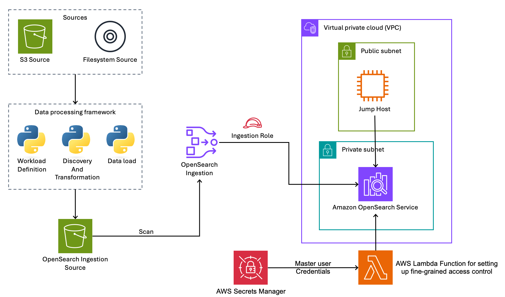

# Amazon OpenSearch Ingestion for Loading Search Data

This repository contains example code that demonstrates how to use OpenSearch Ingestion (OSI) to load and reload data to an Amazon OpenSearch Service domain. It includes a full CDK stack that deploys all of the necessary resources, IAM permissions, and OpenSearch Service fine-grained access control permissions. It includes a flexible workload definition system that enables you to wire in your source data from S3 or the local file system, with flexible discovery and data transformation. 



The solution works with your S3 source bucket, or data from your filesystem. You implement the classes in the `dataset` folder to discover, transform, and load your data to the OpenSearch Ingestion Source S3 bucket. OpenSearch Ingestion scans this bucket at 2 minute intervals for new data, which it processes and loads to the OpenSearch Service domain.

## Prerequisites

- AWS CDK v2: (https://docs.aws.amazon.com/cdk/latest/guide/getting_started.html)
- AWS CLI, installed and configured: (https://docs.aws.amazon.com/cli/latest/userguide/getting-started-install.html)
- Python 3.13.7 (this code was tested at 3.13.7. Earlier versions might also work)

To deploy the solution, first clone the repo and navigate to the ingestion sample directory.

```bash
git clone https://github.com/aws-samples/opensearch-samples.git
cd opensearch-samples/ingestion
```

Next, create and activate a virtual environment and install the requirements. The stack creates a custom resource that invokes a Lambda function to set up fine-grained access control on the domain. That Lambda uses a layer that requires installing dependencies in a `lambda-layer` folder. The script `build-lambda-layer.sh` creates the directory and installs the dependencies (`opensearch-py`). Finally, bootstrap the CDK.

```bash
python3 -m venv .venv
source .venv/bin/activate
pip install -r requirements.txt
./build-lambda-layer.sh
cdk bootstrap aws://ACCOUNT-NUMBER/REGION
```

To deploy the solution, first set the environment variables for your account and region, then run CDK deploy.

> **Important:** The `REGION` used in `cdk bootstrap` must match the `CDK_DEFAULT_REGION` value below. CDK bootstrap is region-specific — if you bootstrap `us-east-2` but deploy to `us-west-2` (or vice versa), the deployment will fail with an error about a missing SSM parameter.

```bash
export CDK_DEFAULT_ACCOUNT=<your-aws-account-id>
export CDK_DEFAULT_REGION=<region for the deployment>
cdk deploy
```

The deployment will take about 10-15 minutes.

## Accessing the OpenSearch Domain

After deployment, you can access OpenSearch Dashboards through the jumphost proxy. The stack outputs provide the necessary connection information.

### Retrieving OpenSearch Credentials

OpenSearch master credentials are stored securely in AWS Secrets Manager. To retrieve them:

```bash
# Get the secret ARN from stack outputs
SECRET_ARN=$(aws cloudformation describe-stacks --stack-name OsiLoadStack \
  --query "Stacks[0].Outputs[?OutputKey=='OsiLoadMasterUserSecretArn'].OutputValue" \
  --output text)

# Retrieve the credentials
aws secretsmanager get-secret-value --secret-id $SECRET_ARN \
  --query SecretString --output text | jq
```

This returns a JSON object with `username` and `password` fields.

### Connecting to the Jumphost

The jumphost provides secure access to the OpenSearch domain, which runs in a private VPC subnet. SSH access is disabled for security; use AWS Systems Manager Session Manager instead.

```bash
# Get the instance ID from stack outputs
INSTANCE_ID=$(aws cloudformation describe-stacks --stack-name OsiLoadStack \
  --query "Stacks[0].Outputs[?OutputKey=='OsiLoadJumphostInstanceId'].OutputValue" \
  --output text)

# Connect via SSM Session Manager
aws ssm start-session --target $INSTANCE_ID
```

### Accessing OpenSearch Dashboards

The jumphost runs an nginx reverse proxy that forwards HTTPS traffic to the OpenSearch domain. Get the dashboards URL from the stack outputs:

```bash
aws cloudformation describe-stacks --stack-name OsiLoadStack \
  --query "Stacks[0].Outputs[?OutputKey=='OsiLoadOpenSearchDashboardsURL'].OutputValue" \
  --output text
```

Open this URL in your browser and log in with the credentials retrieved from Secrets Manager. Note that the jumphost uses a self-signed certificate, so you'll need to accept the browser security warning.

## Access control strategy

The stack creates a single IAM role that OpenSearch Ingestion uses to access all AWS resources and write to the OpenSearch domain. Fine-grained access control (FGAC) on the domain maps this IAM role to a backend role through a custom Lambda function that runs during stack deployment, ensuring proper permissions are configured automatically.

## Configure your workload

Before you can load data, you need to configure your workload (see also [`README.md`](workloads/README.md) in the `workloads` folder). The various scripts take a workload name as a command-line parameter. Use the folder name as your workload name for these scripts. The workload configuration is in the `workloads` folder. Each workload has its own folder, with a `config.py` file that defines the workload parameters. Create an `index_settings.json` file with your desired index settings and mapping. Define your data source by subclassing the `S3Source` or `FileSource` class. 

The framework uses a standardized document ID field called `osi_load_doc_id` to ensure proper indexing in OpenSearch. When you create your workload transformer, specify the source field name in your workload's `config.py` using the `document_id_field` parameter. The BaseTransformer class provides an `add_document_id()` helper method that copies the value from your specified field to the standardized `osi_load_doc_id` field.

For example, if your source data has document IDs in a field called `recordId`, set `document_id_field: "recordId"` in your config, and the framework will automatically copy those values to `osi_load_doc_id`. The OpenSearch Ingestion pipeline is configured to use `osi_load_doc_id` as the document ID field. Alternatively, you can modify the pipeline configuration in `osi_load/pipeline_config.json` to use your preferred document ID field name directly.

## Data processing overview

The `load_to_s3.py` script processes your source data and uploads it in batches to the stack's source S3 bucket (`osi-load-source-bucket`). OpenSearch Ingestion continuously monitors this bucket, scanning for new files every 2 minutes. When new batch files are detected, the pipeline processes them using the configured codec (ndjson for JSON Lines format) and indexes the documents into your OpenSearch domain.  

## Create your index

Before loading any data, you must first create the OpenSearch index with the proper mapping and settings. Use the `create_index.py` script with your workload name to set up the index according to your workload's `index_settings.json` configuration. This ensures the index exists and has the correct field mappings before the OpenSearch Ingestion pipeline attempts to write documents to it.

The `create_index.py` script uses CloudFormation stack outputs to retrieve OpenSearch connection details and creates the index using your workload's specific settings. It reads the `index_settings.json` file from your workload directory and applies those settings to create a properly configured index in the OpenSearch domain. 

```bash
cd <project root>
python dataset/create_index.py <workload-name>
```

The script supports several optional parameters: `--stack-name` to specify a different CloudFormation stack name (defaults to 'OsiLoadStack'), `--region` to override the AWS region (defaults to `us-west-2`), `--delete-existing` to remove any existing index before creating the new one, and `--force` to skip the confirmation prompt for automated usage.

> **Note:** All utility scripts (`create_index.py`, `load_to_s3.py`, `reset_pipeline.py`, `empty_source_bucket.py`, `delete_index.py`) default to `us-west-2`. If you deployed the CDK stack to a different region, you must pass `--region <your-region>` to each script.

## Load your data

To load your data, use the `load_to_s3.py` script with your workload name. This script utilizes your workload's source definition to discover and process your source data, transforming it as needed before uploading it in batches to the stack's source S3 bucket (`osi-load-source-bucket`). OpenSearch Ingestion then picks up these batches for indexing into the OpenSearch domain.

```bash
cd <project root>
python dataset/load_to_s3.py <workload-name>
```

The script supports optional parameters: `--region` to override the AWS region (defaults to `us-west-2`), `--max-documents` to override the document limit from your workload configuration, and `--force` to skip the confirmation prompt that verifies you've created the index first.

## Managing the running pipeline

The code includes a `utilities` folder with some scripts that can help you reset and reload data to the OpenSearch Service domain.

OpenSearch Ingestion tracks which files it has already processed, so this framework is primarily designed for initial data loading and bootstrapping. Once OSI has processed a file, it won't reprocess it even if the file remains in the bucket. To force the pipeline to reprocess existing files, you must stop and restart the pipeline using the `reset_pipeline.py` utility script, which will clear the processing state and allow files to be scanned again.

Example:

```bash
cd <project root>
python utilities/reset_pipeline.py --region <your-region>
```

As you build your workload, you may have many attempts and change the format of the data in the stack's source bucket. To facilitate managing your source bucket, the destructive 💥 `empty_source_bucket` script will delete all objects in the `osi-load-source-bucket`. Warning! This cannot be undone so use with caution. 

OpenSearch Ingestion tracks which files have been scanned by name. The framework outputs objects to the source bucket with standard naming, and numbered objects. Emptying and refilling the bucket **will not** cause new objects to load to OpenSearch unless you load batches to the source bucket that OSI has not seen (in other words, more batches than you have loaded previously). To force OSI to bootstrap again, use the `reset_pipeline` script.

Example:

```bash
cd <project root>
python utilities/empty_source_bucket.py
```

Finally, you might need to adjust your mapping or start over with a new data format. The `delete_index.py` script deletes the `osi_load_index` from your domain. This is also a 💥 destructive operation that cannot be undone, so use it with caution. After you run `delete_index`, make sure to run `dataset/create_index` again to recreate the index with the proper mappings and settings.

Example:

```bash
cd <project root>
python utilities/delete_index.py <workload-name>
```

## Cleaning Up

To avoid incurring future charges, delete the CloudFormation stack:

```bash
cdk destroy
```

This will remove all resources created by the stack, including the OpenSearch domain, S3 buckets, and EC2 jumphost.

## Configurable Security Settings

The stack supports CDK context parameters to tighten security for your environment. Pass them with the `-c` flag during deployment.

### Restrict Jumphost HTTPS Access

By default, the jumphost accepts HTTPS connections from any IP address. To restrict access to a specific IP or CIDR range:

```bash
cdk deploy -c jumphost_allowed_cidr="YOUR_IP/32"
```

### Enable EC2 Detailed Monitoring

To enable CloudWatch detailed monitoring (1-minute intervals) on the jumphost:

```bash
cdk deploy -c enable_detailed_monitoring=true
```

Note: Detailed monitoring incurs additional CloudWatch charges.

## Production Hardening Recommendations

This sample prioritizes simplicity and low cost. For production deployments, consider the following additional measures. See also [THREAT_MODEL.md](THREAT_MODEL.md) for a full security analysis.

### Dependency Management

Run `pip-audit` or `safety check` regularly against `requirements.txt` to detect known CVEs. Pin dependencies and update them as part of your CI/CD pipeline.

### Secret Rotation

The OpenSearch master user secret does not have automatic rotation configured. Implementing rotation requires a custom Lambda function since AWS Secrets Manager does not natively support OpenSearch master user rotation. See the [AWS documentation on custom rotation Lambdas](https://docs.aws.amazon.com/secretsmanager/latest/userguide/rotating-secrets-lambda-function-customizing.html).

### Termination Protection

The sample uses `RemovalPolicy.DESTROY` for easy cleanup with `cdk destroy`. For production, enable EC2 termination protection and consider changing removal policies to `RETAIN` or `SNAPSHOT`.

### S3 Encryption with KMS CMK

The S3 buckets use default SSE-S3 encryption. For compliance requirements that mandate customer-managed keys, add KMS CMK encryption:

```python
encryption=s3.BucketEncryption.KMS,
encryption_key=kms.Key(self, "MyKey")
```

This adds KMS key costs (~$1/month per key plus per-request charges).

### S3 Access Logging

S3 access logging is not enabled because the access log bucket itself cannot log its own access without recursion. For production, create a dedicated logging bucket in a separate account or use [CloudTrail S3 data events](https://docs.aws.amazon.com/AmazonS3/latest/userguide/cloudtrail-logging.html) instead.

### Lambda Reserved Concurrency

The FGAC Lambda runs only during stack deployment as a CloudFormation custom resource and does not serve runtime traffic. For production Lambdas that serve runtime traffic, set `reserved_concurrent_executions` to prevent throttling from affecting other functions.

### OpenSearch Access Policy

When `use_unsigned_basic_auth=True` is set, CDK adds a second access policy statement with `Principal: "*"` to the synthesized CloudFormation template. This is required for FGAC basic authentication to function. The domain is deployed in private VPC subnets with security groups restricting access to the VPC CIDR block only, so this open principal cannot be reached from the internet. See the [OpenSearch FGAC documentation](https://docs.aws.amazon.com/opensearch-service/latest/developerguide/fgac.html) for details.

## Security

See [CONTRIBUTING](../CONTRIBUTING.md#security-issue-notifications) for more information.

For details on the security architecture and threat model, see [THREAT_MODEL.md](THREAT_MODEL.md).

## License

This library is licensed under the MIT-0 License. See the [LICENSE](../LICENSE) file.
